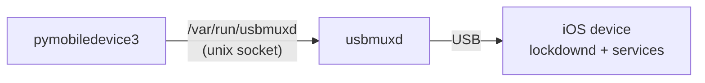
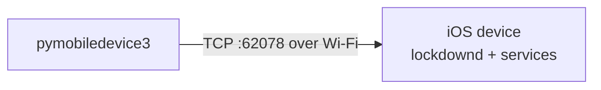
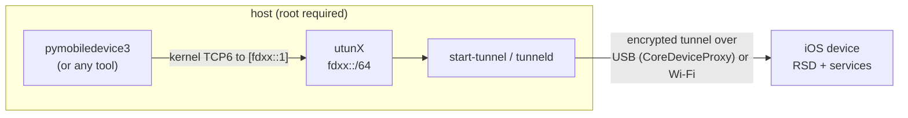
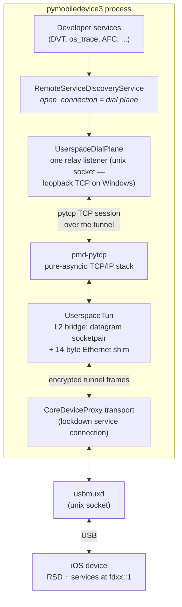
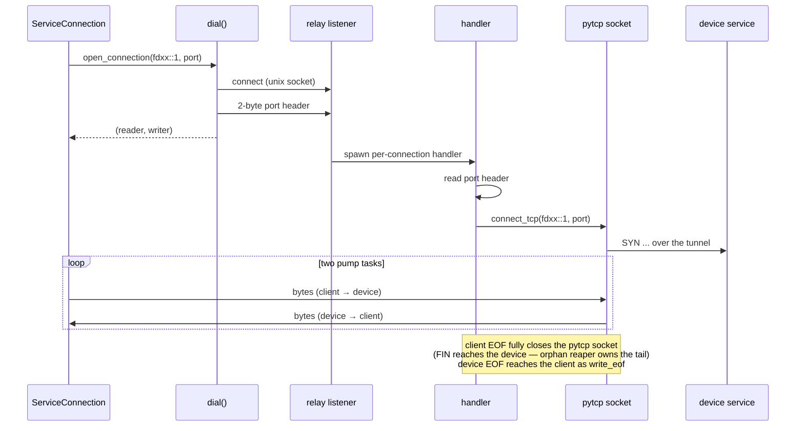
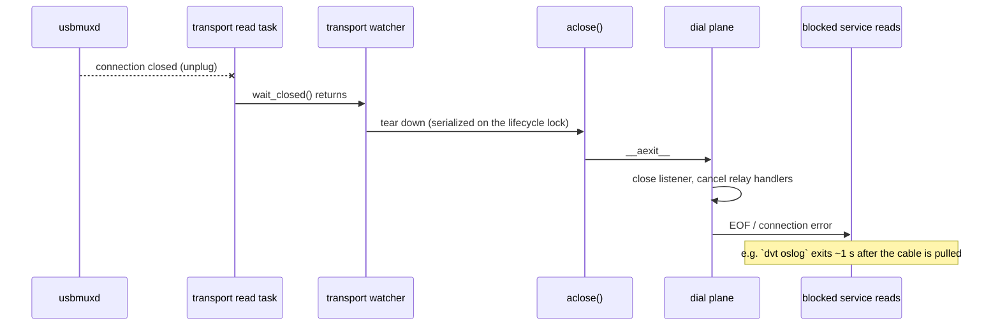
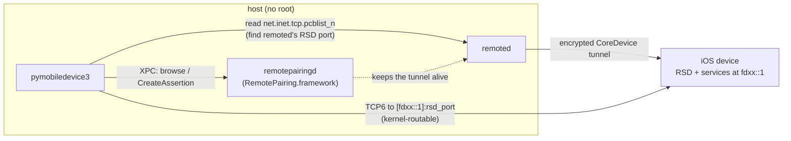

# Understanding the network stacks

Every pymobiledevice3 command reaches the device through one of five transport paths. This
guide shows what each path actually looks like — which sockets exist, what needs root, and
how a device disconnect is detected. For choosing between them day-to-day, see
[iOS 17+ tunnels](ios17-tunnels.md).

## USB lockdown via usbmuxd

The classic path, used by everything that does not need an RSD tunnel (`afc`, `backup2`,
`syslog`, `apps`, ...). No TCP on the host at all: the client speaks the usbmux protocol
over usbmuxd's unix socket, and usbmuxd multiplexes device-port streams over the USB link.

- **Root:** not required.
- **Disconnect:** usbmuxd owns the link — on unplug it closes your socket immediately
  (kernel EOF, no probing needed).
- On Windows usbmuxd's socket is loopback TCP (`127.0.0.1:27015`) instead of a unix socket.

## Wi-Fi lockdown (mobdev2)

The same lockdown protocol, carried over the LAN to port 62078 (`--mobdev2` /
`get_mobdev2_lockdowns`). Devices are discovered over bonjour.

- **Root:** not required.
- **Disconnect:** a Wi-Fi link can die silently, so these connections run TCP keep-alive
  (idle 3 s / interval 3 s) — a vanished device errors out within seconds.

## Kernel tunnel (`start-tunnel` / `tunneld`)

iOS 17+ developer services live behind an encrypted tunnel to an RSD endpoint. The kernel
tunnel terminates that tunnel in a `utun` interface, making the device's tunnel address
(`fdxx::1`) kernel-routable — reachable by **any process**, including external tools like
`lldb`.

- **Root:** required (creating `utun` needs it); `tunneld` is the daemon form that shares
  tunnels across processes, queryable over HTTP (`--tunnel`), optionally on a unix socket
  (`--uds`).
- **Disconnect:** the `utun` interface disappears with the tunnel, erroring connections
  out; service connections also run TCP keep-alive.
- Highest host→device throughput; the only path external tools can use.

### Why this path suspends `remoted` (and why that needs root)

Root is needed here for **two** independent reasons. The obvious one is creating the `utun`.
The second is `remoted` contention, and it is worth spelling out because it is easy to
misdiagnose.

Discovery on this path is bonjour **plus a direct RSD connection**: `get_rsds()` browses
`_remoted._tcp` and then opens the device's RSD RemoteXPC endpoint (port `58783`) on the USB NCM
link (`fe80::…%enX`). macOS `remoted` owns that link — it keeps its own RemoteXPC session to the
device open at all times (`lsof` shows an ESTABLISHED `…->[fe80::…]:58783`). While `remoted` is
running, the device **resets** a second, independent RSD root channel opened by pymobiledevice3 —
seen as an HTTP/2 `RST_STREAM` with `error_code=5`, or a plain connection reset, during the
check-in handshake. So discovery finds the device but yields no usable RSD.

`stop_remoted()` SIGSTOPs `remoted` for the duration of the handshake and resumes it afterwards;
suspending a root-owned daemon is what needs root. With `remoted` suspended the handshake succeeds
reliably, and the device will even accept *several* concurrent RSD sessions — which shows the reset
is caused by `remoted` owning the link, not by any device-side one-session cap.

> **This is not a pairing problem.** A long-standing assumption held that the device *closes the
> host's RSD fd during pairing*, forcing `remoted` to race us — hence `sudo`. That is not what
> happens. The contention reproduces against an already-paired device with no pairing in flight,
> and completing a pairing does **not** tear down existing RSD connections (the device simply adds
> the new tunnel endpoint; `remotepairingdeviced` logs no control-channel teardown). The trigger is
> only that `remoted` is an always-on RSD client for the NCM link. Verified empirically on
> iPhone18,4 / iOS 26.6.1, and against the iOS 17.0, 26.6 and 27 device daemons.
>
> The no-root [userspace tunnel](#userspace-tunnel-the-no-root-default) sidesteps all of this: it
> reaches RSD through the `CoreDeviceProxy` lockdown service over usbmux, never touching the NCM
> link or `remoted`.

## Userspace tunnel (the no-root default)

The default for RSD-required commands on iOS 17.4+ over USB. The kernel interface is
replaced by a pure-Python TCP/IP stack ([pmd-pytcp](https://github.com/doronz88/pmd-pytcp))
running on the process's own event loop — no root anywhere, and no kernel TCP anywhere:

Key properties that fall out of this shape:

- **No root anywhere** — there is no kernel interface; the "network" to the device lives
  entirely inside the process.
- **The tunnel address is in-process only.** `fdxx::1` exists on the pytcp stack, not in
  the kernel routing table, so external tools cannot reach it — the RSD reports this via
  `is_in_process_tunnel`.
- **One tunnel per process.** The pytcp stack is a process-global singleton; every
  open/close transition serializes on a lifecycle lock, and concurrent
  `establish_userspace_rsd()` callers share the winning tunnel instead of racing it.

### Dialing a service connection

Services call the RSD's injected `open_connection`, which relays through a single
pre-bound listener; the target port travels in-band as a 2-byte header, so nothing ever
binds on the dial path:

Why a unix socket for the hand-off: it lives in a `0700` temp directory, so filesystem
permissions decide who may connect — a loopback TCP port would be connectable by any local
process for the tunnel's whole lifetime. Loopback TCP remains the fallback where `AF_UNIX`
does not exist (Windows), and `PYMOBILEDEVICE3_USERSPACE_TCP_RELAY` forces it anywhere for
debugging. A connection that never sends its port header is shed after a timeout instead
of pinning a handler.

### Device disconnect and teardown

Nothing on the relay path can detect a vanished device (both relay endpoints are the same
process, so keep-alive would only probe the local kernel), so the tunnel watches its own
transport: when the CoreDeviceProxy connection dies — USB unplug makes usbmuxd close it
immediately — a watcher task tears the whole tunnel down, surfacing errors to every
blocked service read within about a second:

Teardown details worth knowing when reading the code:

- The dial plane sets a `_closing` gate, gives already-queued accepts one loop tick to
  attach (so their transports can be closed properly), cancels every in-flight relay
  handler, and awaits the listener's `wait_closed()` — this is what keeps
  `Server.wait_closed()` from hanging on a relay parked on device traffic (issue #1756).
- `aclose()` returning means the process-global stack is really stopped: an explicit close
  that races the watcher's teardown waits for it instead of returning early, so
  close-then-reopen is safe.
- The one listener bind that exists is shielded against cancellation:
  `create_server`-style coroutines suspend once *after* the socket is serving, and a
  cancellation landing there would otherwise orphan a listener the event loop keeps alive
  forever.
- The CLI keeps its tunnel for the process lifetime and closes it at interpreter exit
  (~3 ms), so the device always sees clean FINs.

## Native remoted tunnel (macOS only)

`--native` (or `PYMOBILEDEVICE3_NATIVE=1`) reaches the RSD by **piggybacking Apple's own
`remoted` tunnel** instead of building one. It needs no root, no entitlement and no Xcode, and
leaves `remoted` running — so it coexists with Xcode/`devicectl` (contrast the kernel/bonjour path,
which must suspend `remoted`; see the callout above).

How it works (all via `ctypes` + libxpc, no pyobjc):

1. Ask `com.apple.CoreDevice.remotepairingd` (provided by the base-OS `RemotePairing.framework`,
   present on stock macOS — it backs iPhone Mirroring — **not** the Xcode-only `CoreDevice.framework`)
   to browse for the device and open its per-device XPC endpoint.
2. `RemotePairing.CreateAssertionCommand` returns the device's in-tunnel `tunnelIPAddress` and an
   assertion identifier that keeps Apple's tunnel up for as long as the handle is held.
3. Find the in-tunnel RSD port by reading the `net.inet.tcp.pcblist_n` sysctl (no root) and matching
   `remoted`'s own connection to that tunnel address.
4. Connect a normal TCP socket to `[tunnelIPAddress]:rsd_port` — the tunnel address is
   kernel-routable — and run the standard RSD handshake.

- **Root:** not required. **Xcode:** not required.
- **Reachability:** the tunnel address is a real kernel route (Apple's tunnel), so unlike the
  userspace tunnel it *is* reachable by other tools; it lives only while the handle (its assertion)
  is held.
- **Default on macOS:** this is the built-in default transport for RSD-required commands (and the
  CLI's automatic retry) on macOS — chosen ahead of the userspace tunnel, with userspace and then
  `tunneld` as fallbacks. On other platforms the userspace tunnel remains the default (`remoted` does
  not exist there).
- **Overriding the default:** `PYMOBILEDEVICE3_DEFAULT_FALLBACK=native|userspace|tunneld` sets which
  transport the automatic selection prefers. Set it to `userspace` to opt back out of the macOS
  native default, or `tunneld` to route to the privileged daemon.
- **Throughput:** rides the kernel-routable tunnel, so it avoids the userspace stack's per-packet
  Python overhead. Fair same-device AFC comparison on a physical iPhone 17-class device: device->host
  is USB-bound and on par with the userspace tunnel (~36 MB/s both), while host->device is ~1.8x
  faster (~36 vs ~20 MB/s — the userspace stack keeps its send segments deliberately small) and
  per-request latency is ~1.6x lower (~8 vs ~13 ms). All with no root.
